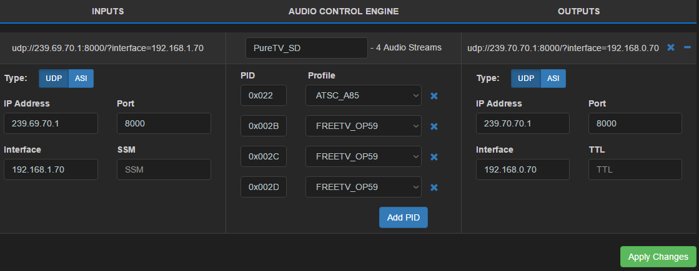

# Loudness processing workflow fields explained

Explanations for each of the fields displayed in a Loudness Processing Workflow are explained below:

#### Inputs

Each input must be an MPEG Transport Stream (SPTS or MPTS) arriving at the server via UDP/IP (Ethernet) or ASI interfaces.

##### UDP

**IP address**

This is the IP address of the device which is originating the MPEG Transport Stream. If using a multicast address, it must fall within the range 224.0.0.0 to 239.255.255.255.

**Port**

The Port on which the MPEG Transport Stream input will be received (destination port), in other words, the port on the local server which receives the input.

Enter a number between 1 and 65535.

**Interface**

The IP address of the physical server hardware interface which will receive the MPEG Transport Stream. This field is provided in the case that more than one network interface is present on the server.

**SSM**

Source Specific Multicast. In a network using Protocol Independent Multicast routing (specifically PIM-SSM), this value is the source IP address of the multicast stream. When paired with the multicast IP address (above), it allows the Matrix ACE server to receive the specific multicast stream.

##### ASI

**Card**

The physical ASI card number as identified by the operating system. The first ASI card on the server will usually have a number of 0. Subsequent additional ASI cards will be numbered 1,2,3... etc. The number of ASI cards which can be added to a server will depend on the capacity of the server.

Enter the port number as an integer.

**Port**

The number of the physical port receiving an MPEG Transport Stream input on the card identified by the Card number above. The first port is usually numbered 0, with port numbers ascending through 1,2,3. A four port ASI card will have port numbers 0, 1, 2 and 3. A two port ASI card will have port numbers 0 and 1.

Enter the port number as an integer.

**FIFO Size**

The size of the First-In-First-Out (FIFO) buffer. A FIFO buffer manages the flow of data delivery by storing MPEG Transport Stream data in a memory buffer as it is received and releasing the data for processing in the same order that it was received (the first data into the buffer is the first data out).

This value sets the buffer size on the DekTec ASI card (default 2MB). 2MB is often too large a buffer size. This setting allows users to tune latency by decreasing the buffer size on the ASI card itself.

Enter a value in Megabytes (Mb).

#### Audio streams
**Audio elementary stream Program IDs (PIDs)**

Each audio elementary stream which is to be processed for loudness normalization, must be identified by its Program ID (PID).

Enter the audio elementary stream's Program ID in hexadecimal (e.g. 0x0022) or decimal format (e.g. 34).

**Loudness profiles**

A loudness profile must be selected to apply to each audio elementary stream (specified by its PID above). The loudness profile provides parameters for the [loudness normalization of the audio stream](LoudnessProcessingExplained.md).

Loudness profiles are defined on the [Profiles tab of the web user interface](LoudnessProfiles.md).

Choose a loudness profile from the drop-down list provided.

#### Outputs

Each input must have a corresponding output configured.

##### UDP

**IP address**

For a Unicast stream, this is the IP address of the computer which is receivingthe MPEG Transport Stream (the remote computer). For a Multicast stream this is the multicast address originating the stream (this server). A multicast address must fall within the range 224.0.0.0 to 239.255.255.255.

**Port**

The Port over which the MPEG Transport Stream output will be transmitted, in other words, the port on the local server which transmits the output stream.

Enter a number between 1 and 65535.

**Interface**

The IP address of the physical server hardware interface which will transmit the MPEG Transport Stream. This field is provided in the case that more than one network interface is present on the server.

##### ASI

**Card**

The physical ASI card number as identified by the operating system. The first ASI card on the server will usually have a number of 0. Subsequent additional ASI cards will be numbered 1,2,3... etc. The number of ASI cards which can be added to a server will depend on the capacity of the server.

Enter the port number as an integer.

**Port**

The number of the physical port transmitting an MPEG Transport Stream output on the card identified by the Card number above. The first port is usually numbered 0, with port numbers ascending through 1,2,3. A four port ASI card will have port numbers 0, 1, 2 and 3. A two port ASI card will have port numbers 0 and 1.

Enter the port number as an integer.

**FIFO Size**

The size of the First-In-First-Out (FIFO) buffer. A FIFO buffer manages the flow of data delivery by storing MPEG Transport Stream data in a memory buffer as it is received and releasing the data for transmission in the same order that it was received (the first data into the buffer is the first data out).

This value sets the buffer size on the DekTec ASI card (default 2MB). 2MB is often too large a buffer size. This setting allows users to tune latency by decreasing the buffer size on the ASI card itself.

Enter a value in Megabytes (Mb).
