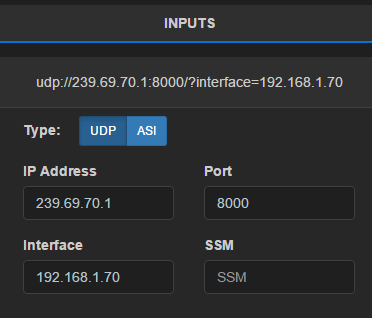
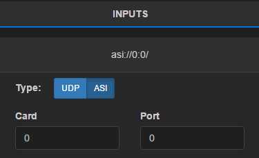
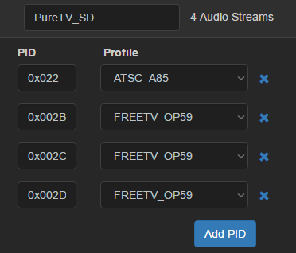
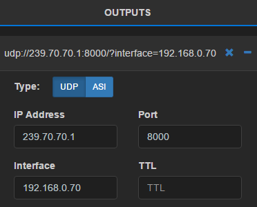
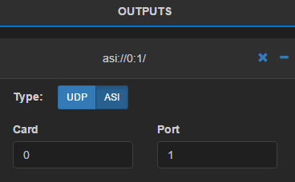
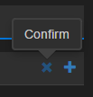

# Loudness processing workflows

The processing of MPEG Transport Streams for loudness normalization is configured from the Matrix ACEDashboard.

Each loudness processing workflow consists of:

1. Values for Input parameters
1. Program IDs for each audio elementary stream to be processed
1. The Loudness Profile to apply to each audio elementary stream defined
1. Values for Output parameters

### Input parameters

Each input must be an MPEG Transport Stream (SPTS or MPTS) arriving at the server via UDP/IP (Ethernet) or ASI interfaces.

### Audio elementary stream Program IDs (PIDs)

Each audio elementary stream to be processed for loudness normalization, must be identified by its Program ID (PID).

### Loudness profiles

A loudness profile must be selected to apply to each audio elementary stream. The loudness profile provides parameters for the loudness normalization of the audio stream.

### Output parameters

Each input must have a corresponding output configured. Output can be configured for UDP/IP (Ethernet) or ASI interfaces.

## Create a new loudness processing workflow

The processing of MPEG Transport Streams for loudness control is configured from the Matrix ACEDashboard.

A processing workflow determines how an input MPEG transport stream has some or all of its audio elementary streams processed for loudness normalization.

Each workflow requires details for input, audio streams to be processed, a loudness profile for each audio stream and output.

For details on the data fields of a loudness processing workflow, refer to the topic: [Loudness processing workflow fields explained](LoudnessProcessingWorkflowFields.md).

The process for creating a new loudness processing workflow is outlined below:

- From the Dashboard, click the **Create** button to create a new loudness processing workflow
- Enter a name for the workflow
- Enter the Input details (UDP or ASI)

**IP inputs**           |           **ASI inputs**
:--------------------------------:|:---------------------------------:
 | 

- Enter the Program IDs for the audio elementary streams to be processed for loudness normalization
- Select a loudness profile for each audio stream. This determines the loudness normalization parameters to be applied to each stream.

- Enter Output details (UDP or ASI)

**IP inputs**           |           **ASI inputs**
:---------------------------------:|:----------------------------------:
 | 

## Modify a loudness processing workflow

The process for modifying a loudness processing workflow is outlined below:

- From the Dashboard, click the **Expand** button to the right of the loudness processing workflow to be modified
- The workflow fields expand, allowing users to modify them

- Modify the fields as desired
- Click the **Apply Changes** button to save your changes.

## Delete a loudness processing workflow

The process for deleting a loudness processing workflow is outlined below:

- From the Dashboard, click the **Delete** button to the right of the loudness processing workflow to be modified

- Click the **Confirm** popup to confirm that you want to delete the workflow
- The workflow is deleted.

[Click here to read an explanation of each of the fields in a loudness processing workflow](LoudnessProcessingWorkflowFields.md)
